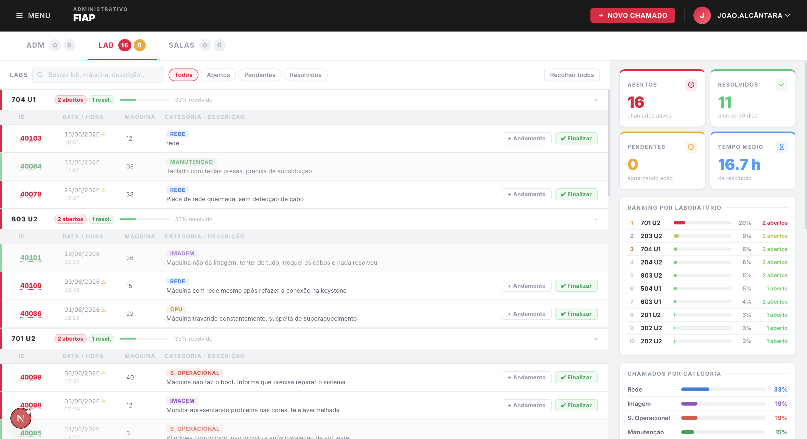
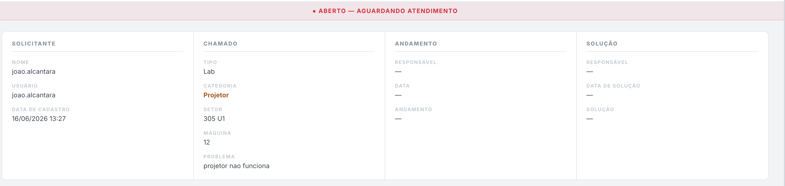
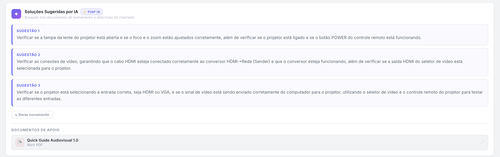
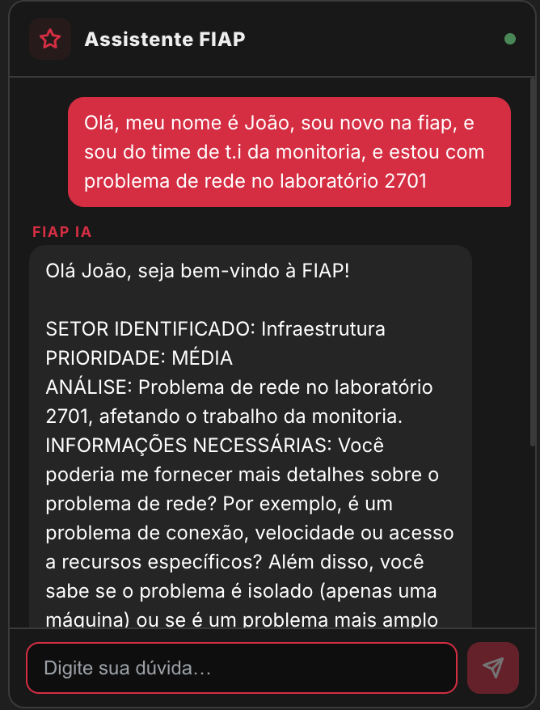
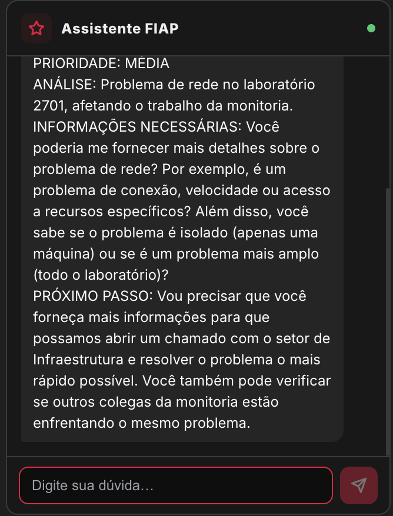

# 🚀 HackOps — Dashboard Inteligente de Chamados FIAP

Projeto desenvolvido durante o **HackOps FIAP** com o objetivo de modernizar a experiência de acompanhamento e resolução de chamados técnicos dos laboratórios da instituição.

---

## 📸 Preview











---

## 📖 Sobre o Projeto

O sistema atual de chamados da intranet da FIAP permite registrar e acompanhar ocorrências técnicas dos laboratórios, mas oferece uma visão limitada para monitores e equipes de suporte, dificultando a identificação rápida de problemas e o acompanhamento de métricas relevantes.

O nosso desenvolvimento propõe uma nova abordagem para esse processo, transformando os dados dos chamados em um painel operacional moderno, com indicadores em tempo real, análise de tendências e suporte assistido por inteligência artificial.

A plataforma centraliza as informações de todos os laboratórios em uma única interface, permitindo identificar ocorrências com mais agilidade, monitorar métricas importantes e auxiliar os técnicos durante o diagnóstico e a resolução dos chamados.

🤖 IA especializada em chamados técnicos
Como principal diferencial, a solução conta com uma IA especializada em chamados técnicos, treinada a partir dos materiais utilizados nos treinamentos de monitores e equipes de suporte. Ao analisar um chamado, a IA:

Identifica o contexto da ocorrência;
Consulta os documentos mais relevantes para o caso;
Sugere procedimentos para diagnóstico e resolução do problema;
Apresenta os documentos utilizados como referência, permitindo que o usuário consulte diretamente a fonte das informações.

Dessa forma, o atendimento ganha consistência e rastreabilidade, reduzindo o tempo de resposta e a dependência de conhecimento individual.

💬 IA de suporte geral
A plataforma também disponibiliza uma IA de suporte geral, desenvolvida para responder dúvidas relacionadas ao ambiente de trabalho e aos diversos setores da instituição. O assistente auxilia colaboradores com informações sobre processos internos e áreas operacionais da FIAP, como monitoria, coordenação, infraestrutura, audiovisual, suporte técnico, recursos humanos, financeiro e eventos.

---

## ✨ Funcionalidades

### 📊 Dashboard Operacional

- Visualização de chamados agrupados por laboratório
- Busca e filtros por status
- Histórico completo de andamentos
- Atualização dinâmica dos indicadores
- Visão consolidada dos laboratórios

### 📈 Métricas e Indicadores

- Total de chamados
- Chamados abertos, pendentes e resolvidos
- Tempo médio de resolução
- Tendência mensal e anual de ocorrências
- Ranking dos laboratórios com maior incidência de problemas
- Distribuição de chamados por categoria

### 🤖 Assistente de IA

- Sugestões de diagnóstico para chamados
- Consulta à base de conhecimento interna
- Respostas contextuais para dúvidas operacionais
- Streaming de respostas em tempo real
- Cache de respostas para melhor desempenho

### 📚 Base de Conhecimento

- Procedimentos de monitoria
- Procedimentos acadêmicos e operacionais
- Documentação utilizada no treinamento de monitores

---

## 🛠️ Tecnologias Utilizadas

| Tecnologia | Utilização |
|------------|------------|
| Next.js 15 | Framework principal |
| React 19 | Interface da aplicação |
| TypeScript | Tipagem estática |
| Styled Components | Estilização |
| Chart.js | Gráficos e indicadores |
| GSAP | Animações |
| Groq SDK | Integração com IA |
| Llama 3.3 70B | Modelo de linguagem |
| WebLLM | Fallback local |

---

## 📂 Estrutura do Projeto

```text
src/
├── app/
│   ├── api/
│   ├── documentos/
│   ├── layout.tsx
│   └── page.tsx
│
├── components/
│   ├── atoms/
│   ├── molecules/
│   └── organisms/
│
├── hooks/
├── lib/
├── styles/
└── templates/
```

---

## ⚙️ Configuração

Crie um arquivo `.env.local` na raiz do projeto:

```env
GROQ_API_KEY=sua_chave_aqui
```

---

## ▶️ Executando o Projeto

Instale as dependências:

```bash
npm install
```

Inicie o ambiente de desenvolvimento:

```bash
npm run dev
```

A aplicação estará disponível em:

```text
http://localhost:3000
```

### Build de Produção

```bash
npm run build
npm run start
```

---

## 🧠 Inteligência Artificial

O sistema utiliza o modelo **Llama 3.3 70B**, disponibilizado por meio da **Groq API**, para auxiliar monitores e técnicos durante o atendimento dos chamados.

As respostas são enriquecidas com documentos internos utilizados nos processos de monitoria e suporte técnico, permitindo sugestões mais contextualizadas e alinhadas à realidade operacional dos laboratórios.

---

## 💾 Persistência de Dados

Os dados são armazenados localmente utilizando `localStorage`.

| Chave | Conteúdo |
|--------|----------|
| fiap-chamados | Lista de chamados |
| fiap-andamentos | Histórico de andamentos |
| fiap-user | Usuário ativo |

---

## 🎯 Objetivo

Fornecer uma experiência moderna para o acompanhamento de chamados técnicos, permitindo que monitores e equipes de suporte tenham acesso rápido às informações necessárias para diagnosticar problemas, acompanhar tendências e reduzir o tempo de resolução.

---

## 👨🏻‍🏫 Pitch de apresentação

https://www.canva.com/design/DAHMpLekqsA/vaW8QfGByUci64BhcCaZBg/edit

---

## 👨🏻‍💻 Desenvolvido por

- João Victor Alcântara
- Gustavo Rocca
- Mateus Leccese
- Gabrielly Camilo

**HackOps • FIAP • 2026**
# Projeto-Hackops-fiap-2026
